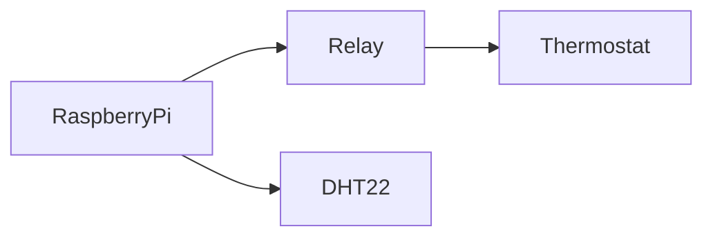

# Raspberry Pi Thermostat
The following codebase provides a web interface to interact with a thermostat. The user is able to set a desired temperature and the backend logic will ensure that the desired temperature is met by either turning the heating on or off. 

## Physical Setup
In our setup our Raspberry Pi 3b+ is connected to the following using the GPIO pins:
* [A DHT22 Temperature and Humidity Sensor](https://www.waveshare.com/wiki/DHT22_Temperature-Humidity_Sensor)
* [A Salus ERT20TX Thermostat](https://salus-controls.com/files/ERT20TX-Ver002.pdf) via a [5V relay](https://www.amazon.co.uk/gp/product/B01H2D2RI0/ref=ppx_yo_dt_b_search_asin_title?ie=UTF8&psc=1)

The Salus thermostat is connected to the boiler over a wireless signal. However, the thermostat itself lacks features of a smart thermostat. The back of the Salus thermostat has various pins. By default, when none of the pins are bridged (connected to each other) the thermostat is in heating mode. If we bridge the cooling pins together the thermostat will switch to cooling mode. As we are not connected to a cooling system, we can exploit this and switch to cooling mode in order to turn the heating off. 

In order to bridge the cooling pins together we are using a [relay](https://en.wikipedia.org/wiki/Relay) in order to programmatically bridge the cooling pins when we want to turn the heating off. Below is a diagram showing the setup:

